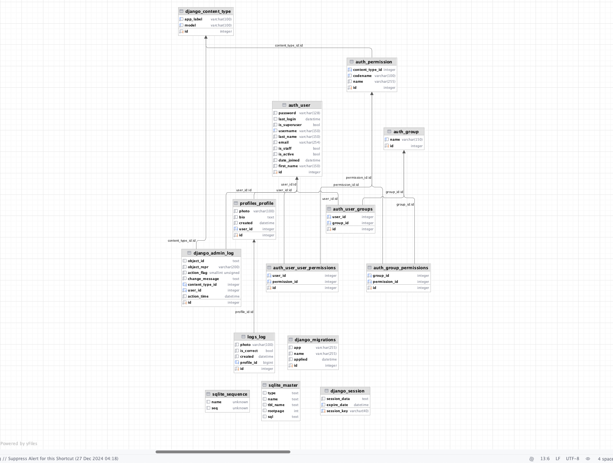

= A FACIAL RECOGNITION-BASED AI AUTHENTICATION SYSTEM
Eren Kaya <nereayak@hotmail.com>
3.0, December 27, 2024: AsciiDoc article template
:toc:
:icons: font
:url-quickref: https://docs.asciidoctor.org/asciidoc/latest/syntax-quick-reference/

== Abstract

This is a showcase for a system by utilising Django with libraries such as Face-recognistion for creating a system to allow users to log in to an app through facial recognition. The system will be able to detect the user's face and compare it in the tables in the database to authenticate the user. The explanation on how to install and set up the environment is in the Read Me file.

== List of Abbreviations

AI:: Artificial Intelligence
FRS:: Facial Recognition System
CNN:: Convolutional Neural Network
ML:: Machine Learning
DL:: Deep Learning
FER:: Facial Expression Recognition
UI:: User Interface
MFA:: Multi-Factor Authentication
OpenCV:: Open Source Computer Vision Library able to detect the user's face and compare it in the tables in the database to authenticate the user. The explanation on how to install and set up the environment is in the Read Me file.

== Introduction

This application is a showcase demonstration of the usage of Django and Face-recognition libraries to create a system that allows users to log in to an app through facial recognition. The system will be able to detect the user's face and compare it to the database of faces to authenticate the user.

== Overview

Facial recognition FRS-based authentication systems are proving to be a solid solution to the common problem of securing access control while also being user-friendly. With novel artificial intelligence and computer vision CV technologies, these systems can easily recognize a person’s face profile by unique features and landmarks, meaning that such an authentication method can be considered safe, as well as intuitive and unobtrusive.

The proposed AI system, built on the basis of facial recognition technology, is designed to improve security and change the current approach to user authentication towards increasing its convenience. Eliminating any need for passwords or physical tokens, this solution helps to simplify and to optimize the authentication process, this avoiding the possibility of a forgotten credential or lost an access key.

== Identification of the Need for the System

In the current digital landscape, as cybersecurity threats continue to evolve, and user experience becomes increasingly critical to conditioning users’ adoption of technologies, the demand for both secure and user-friendly authentication is on the rise. Indeed, existing authentication methods, including passwords and physical tokens, are associated with numerous risks—losing due to theft, human error, and forgetting among them. With that in mind, our facial recognition-based authentication system is both secure and convenient. Based on an individual’s biometric data – that is both highly unique and difficult to replicate – the method is secure, and since it is both smooth and touchless, it improves the user experience for multiple uses covering access control, secure transactions, and identification in general.

== Architecture

Django is used as backend framework due to its battery included philosophy. For the User Interface instead of only using Django as backend and using static for frontend, we will use Django as a full stack framework. The frontend will be created using Django's built-in templating engine. The system will have two main pages: the login page and the profile page.

== Evaluation

The assessment of the facial detection and enrollment sub-system within its entirety is being conducted in order to monitor all the above for the accuracy, efficiency and security. This would be done by monitoring the accomplishment of detection accuracy, processing speed, and data security.

The input collected from user will help in identification of problems and also areas that can be improved. The authentications will be logged in the `logs` table to ensure about the privacy regulations and protecting against the possible threats. The evaluations of these safety systems proved to be efficient in adjusting them to the highest standard of their functionality.

== Libraries Used

the libraries can be found in the requirements.txt file. We could have used pipfiles but for the sake of simplicity we will use requirements.txt file. The libraries are as follows:

* asgiref==3.8.1
* click==8.1.8
* Django==5.1.4
* dlib==19.24.6
* face-recognition==1.3.0
* face-recognition-models==0.3.0
* numpy==2.2.1
* pillow==11.0.0
* sqlparse==0.5.3
* typing_extensions==4.12.2

== Installation

The installation process is simple. You only need to clone the repository and fallow the steps in Readme.MD.

=== Database Setup
The migrations files are in migration folders of corresponding apps in the project. The migrations can be applied by running the following command:

``python manage.py makemigrations``
``python manage.py migrate``

.Database Structure

=== Admin Panel Setup

Django's default admin panel is used for the system. The admin panel can be accessed by going to /admin and logging in with the superuser credentials. For creating superuser the necessary commands are in the Make file.

``python manage.py createsuperuser``

.Admin panel

== Created Apps, Models Structure and Signals

`Profiles` and `Logs` app is created.

For since it is for showcasing projects, the database is chosen to be SQLite database. The database is extended with two tables called `Profiles` and `Logs`.

`Profiles` have fallowing fields:

* user (unique one-to-one relationship with the Django User model)
* photo (image field which app stores in photos directory)
* bio (text field to store further information about the user)
* created (to keep tract of the creation time)

`Logs` have fallowing fields:

* profile (one-to-one relationship with the Profile model)
* photo (image field that is uploaded)
* is_correct (boolean filed to keep track of the correctness of the system)
* created (to keep track of the creation time)

I implemented a receiver since after a user is created there was a need to create a profile for them. This profile will have a one-to-one relationship with the Django User model. The logs will be created after the user logs in to the system. The logs are used to keep track of the actions that come from the UI and further validate the creativeness of the system.

== UI Templates

UI templates are jinja templates that are connected to django files. The actions for creating AJAX requests are done in those files and for a good look bootstrap is used.

== Routes

MVT(model-view-template) architecture is used in this app. Thus, routes are in the view.

=== Login Page:

login page is created with 'login.html' file. User can upload their picture wia their camera. Afterward the image is sent to the backend for face recognition. If the face is recognised, the user is redirected to the home page.

.Login Page

=== Home Page:

It is the page where the client will be redirected after getting authenticated by the system. The page is protected with "@login_required" decorator.

.Home Page

== Functions

We have 2 functions at the backend one for parsing the page and encode the image and the other one is for the face recognition. The face recognition function is used to compare the user's face to the database of faces to authenticate the user.

== Security measures

CSRF token is added to the templates for security. The system is also protected against SQL injection attacks by using Django's ORM. The system is also protected against XSS attacks by using Django's templating engine.

== Conclusion

In conclusion, the creation of the facial recognition-based authentication system presents a significant step forward in the field of secure and user-friendly access control systems. By incorporating the latest artificial intelligence and computer vision technologies, this system brings a hands-free and hassle-free authentication method that does not require passwords or physical tokens, hence the authentication process becomes simpler and more efficient. The system's capability of picking out individuals by their unique facial features provides both security and comfort, which makes it suitable for various applications like access control, secure transactions, and identification.

In addition to this, the thorough testing that is done in the Integration and Evaluation phases ensures that the system complies with highly demanding performance, accuracy, and security requirements. The system of facial recognition authentication is a result of a careful testing of each component and a quick fixing of any problems that may be found. It is a dependable, efficient and secure solution. Furthermore, the system’s compliance with the regulations and privacy policies highlights the system’s intention to protect user data and minimize the risks that may arise. Ultimately, the combination of these efforts leads to the creation of a reliable authentication system that not only provides for increased security but also improves the user experience, thus facilitating wide adoption in different industries and sectors.

Ultimately, the rise of facial recognition-based authentication systems is the most significant step in the field of security technology which provides a multifaceted solution that combines maximum protection with user convenience. Through the use of artificial intelligence and computer vision these systems bring about a method of identity verification that is both smart and highly accurate and also easy to use. In addition, their flexibility to a variety of environmental conditions and the ease with which they can be incorporated into the existing access control infrastructure are features that make them ideal for use in a variety of industries and contexts, including corporate offices and public spaces.

Moreover, the fact that facial recognition technology can be implemented successfully shows that it has the potential to change the way we authenticate ourselves. Therefore, in the future, passwords and physical tokens may become unnecessary. As these technologies continue to evolve, with the progress of algorithm development and the improvement of hardware capabilities, they are expected to be more intelligent and accurate in the future. Therefore, the implementation of facial recognition-based verification marks not only substantial progress in security technology but also a peek into the future of the frictionless access control system.

== Future improvements

The app showcase the usage of an image to compare the user's face to the database of faces to authenticate the user. The system can be improved by adding containers to deploy on kubernetes and adding extra endpoints to validate the user's face to third party services. Since the UI will be hosted with the same domain as the backend it would not require any extra configuration for CORS. If it needed for extra authentication the authentication headers can be used to whitelist the domain in a dynamic sense. The whitelisted domains can be obscured by accepting calls by the whitelisted ones.

== References

[1] Kanade, T. (1973). Picture processing system by computer complex and recognition of human faces. Ph.D. thesis, Kyoto University.
[2] Taigman, Y., Yang, M., Ranzato, M., & Wolf, L. (2014). DeepFace: Closing the gap to human-level performance in face verification. In Proceedings of the IEEE Conference on Computer Vision and Pattern Recognition (pp. 1701-1708).
[3] Jain, A. K., Ross, A., & Prabhakar, S. (2004). An introduction to biometric recognition. IEEE Transactions on Circuits and Systems for Video Technology, 14(1), 4-20.
[4] Shen, C., Yu, Z., Bansal, S., & Patel, V. M. (2017). Lightweight continuous authentication with eye movements. In Proceedings of the 2017 IEEE International Joint Conference on Biometrics (IJCB) (pp. 145-154).
[5] Kindt, E. J. (2013). Privacy and data protection issues of biometric applications. Springer.
[6] Erkin, Z., Troncoso-Pastoriza, J. R., Lagendijk, R. L., & Pérez-González, F. (2013). Privacy-preserving data aggregation in smart metering systems: An overview. IEEE Signal Processing Magazine, 30(2), 75-86.
